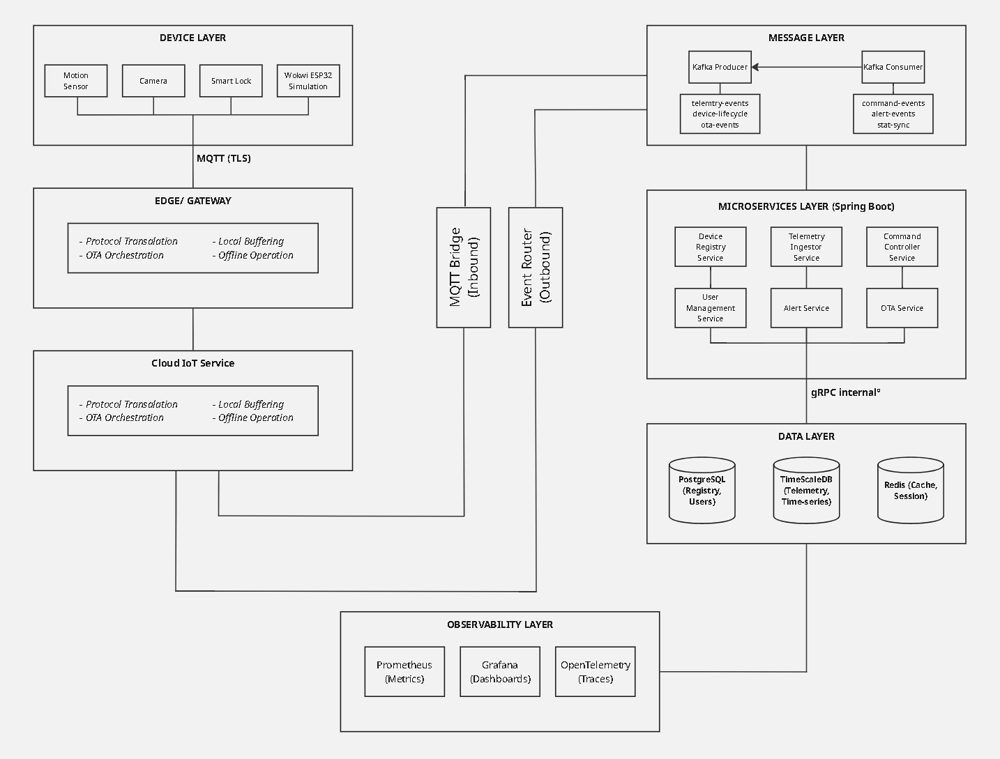

# IoT-Based Smart Home Security with Cloud Integration

This project is a Spring Boot-based IoT smart home platform tgat connects devices like motion sensors, smart locks, and ESP32 simulators (via Wokwià to secure cloud backend.

it integrates MQTT, Kafka, gRPC, PostgreSQL, TimescaleDB, and Redis to handle telemetry, commands, and alerts in real time.

## Context
There is no specific context, it's just my major related topic and i want to go wild on it.

## System Architecture

